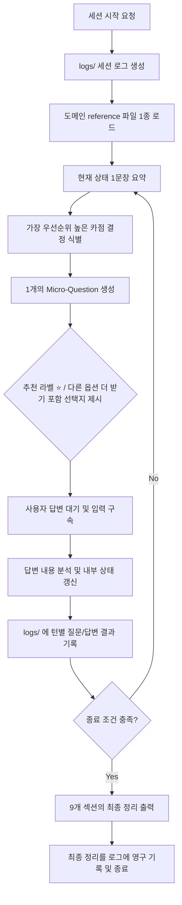

# 🎯 Ultra Grill Me (소크라테스식 압박 검증 스킬)

<p align="center">
  <a href="./README.md">English</a> | <a href="./README.ko.md">한국어</a> | <a href="./README.zh.md">简体中文</a>
</p>
`ultra-grill-me`는 사용자의 다양한 기획, 아키텍처, 코드 모델, 비즈니스 전략 등을 바로 코드나 문서로 생성하기 전에, **한 번에 하나의 질문으로 모호성과 약점을 반대신문하듯 깎아나가는 검증 전용 AI 에이전트 스킬(Agent Skill)**입니다. 

"대신 작성해주는 스킬"이 아니라, **"실행하기 전에 실패 가능성을 지워나가는 예방적 검증 스킬"**로 작동합니다.

---

## 1. 세션 동작 메커니즘 (Mermaid Flow)

에이전트는 사용자가 세션을 시작하면 다음과 같은 철저한 Socratic 루프를 돌며 작동합니다.



---

## 2. 10대 검증 도메인 및 Reference 매핑

이 스킬은 사용자의 기획 도메인 성격에 따라 특화된 10개의 reference 마크다운 스펙을 로드해 전문성을 확보합니다.

| 도메인 영역 | 대상 파일명 | 중점 검증 및 질문 철학 |
| :--- | :--- | :--- |
| **제품 / SaaS 아이디어** | [product-idea-grill.md](file:///skills/ultra-grill-me/references/product-idea-grill.md) | ICP 좁히기, 사용자 페인포인트 정량화, 핵심 1개 기능의 MVP 경계선 확립 |
| **개발 구현 설계** | [technical-design-grill.md](file:///skills/ultra-grill-me/references/technical-design-grill.md) | Latency/가용성 등 비기능적 요구사항(NFR), 데이터 일관성 및 동시성, 장애 복구 시나리오 |
| **아키텍처 결정 (ADR)** | [architecture-decision-grill.md](file:///skills/ultra-grill-me/references/architecture-decision-grill.md) | 대안 기술 비교(현상 유지 필수), 아키텍처 결정을 번복할 때의 기회비용(가역성) |
| **구현 / 일정 계획** | [implementation-plan-grill.md](file:///skills/ultra-grill-me/references/implementation-plan-grill.md) | 완료 조건(DoD), 작업 단위 3일 이내 쪼개기, 외부 심사 의존성 리스크 및 롤백 파이프라인 |
| **사업 전략 / GTM** | [business-strategy-grill.md](file:///skills/ultra-grill-me/references/business-strategy-grill.md) | 실제 결제 주체와 사용자의 구분, 초기 10명의 유료 고객 확보 채널, 가격 패키징 |
| **글쓰기 / 내러티브** | [writing-direction-grill.md](file:///skills/ultra-grill-me/references/writing-direction-grill.md) | 타겟 독자의 지식 깊이 정의, 1개 단일 핵심 메시지 추출, 독자가 취할 다음 행동(CTA) |
| **연구 질문 / 가설** | [research-question-grill.md](file:///skills/ultra-grill-me/references/research-question-grill.md) | 인과관계를 입증할 통제 변수 및 독립 변수 식별, 대조군(Baseline), 통계적 유의미 역치 |
| **학습 계획 / 로드맵** | [learning-plan-grill.md](file:///skills/ultra-grill-me/references/learning-plan-grill.md) | 자가 평가가 가능한 작은 토이 프로젝트 목표 설정, 주간 가용 시간 한계, 피드백 메커니즘 |
| **개인 의사결정** | [personal-decision-grill.md](file:///skills/ultra-grill-me/references/personal-decision-grill.md) | 개인의 비타협적 조건(제약) 명시, 기회비용 분석, 최악 시나리오 체험 실험 설계 |
| **Agent Skill 설계** | [skill-design-grill.md](file:///skills/ultra-grill-me/references/skill-design-grill.md) | 스킬의 좁은 반복 범위(Scope), 발동(Trigger)과 오발동(Non-trigger) 시나리오 경계 |

---

## 3. 대화 예시 (Socratic Conversation Flow)

에이전트는 사용자가 모호한 계획을 던졌을 때 다음과 같이 대답을 유도합니다.

```
[사용자]: "새로 기획 중인 1인 개발자용 할일 관리 앱 검증해줘."
---
[에이전트]:
**현재 이해**: 개발자용 할일 관리 앱 아이디어를 검증하고 싶은 상태입니다.

**막힌 결정**: 대상 사용자의 범위가 너무 넓어, 구체적인 킬러 기능과 성공 지표를 정의할 수 없습니다.

**질문**: 이 앱을 사용할 1차 타겟 개발자는 누구인가요?

**왜 중요한지**: 개발자마다 업무 스타일(프리랜서, 대기업 사원, 1인 개발자)이 다르므로, 구체적인 타겟을 좁혀야 이들의 진짜 페인포인트를 해결하는 기능 범위(MVP)를 도출할 수 있습니다.

**선택지**:
1. (추천) 1인 개발자 또는 인디 해커 — 여러 프로젝트의 컨텍스트 스위칭과 일정 관리에 집중
2. 5인 이하 소규모 스타트업의 풀스택 개발자 — 협업과 빠른 배포 동기화에 집중
3. 대기업에 근무하는 플랫폼 엔지니어 — 티켓 관리 시스템(Jira 등)과의 연동에 집중
4. 다른 옵션 더 추천받기
5. 직접 답변

번호를 선택하거나, 다른 옵션을 요청하거나, 직접 답해 주세요.
```

---

## 4. `skill-forge` CLI 설치 가이드

저장소 공통 CLI 도구를 사용하여 원하는 에이전트 도구 환경에 지정된 언어 버전으로 즉시 이식합니다. 

> [!NOTE]
> `--lang ko` 옵션을 주면, 소스 폴더 내의 `SKILL.ko.md`가 타겟 경로에 `SKILL.md`로 변환되어 이식됩니다. references 내 한국어 마크다운들도 접미사를 떼고 깨끗하게 덮어쓰여 연동됩니다.

```bash
# 1. 지원하는 모든 프로젝트 로컬 agent 경로에 한국어 버전 설치 (기본값: global)
skill-forge install ultra-grill-me --lang ko

# 2. Claude Code에 한국어 버전으로 로컬 설치
skill-forge install ultra-grill-me --lang ko --agent claude

# 3. Cursor 프로젝트 로컬에 영어 버전으로 설치
skill-forge install ultra-grill-me --lang en --agent cursor

# 4. 지원하는 모든 프로젝트 로컬 agent 경로에 명시적으로 설치
skill-forge install ultra-grill-me --lang ko --agent global
```

---

## 5. 세션 로그 및 품질 관리

### 세션 로그 파일
- 스킬이 발동되면 활성화된 설치본의 루트 기준 `logs/` 디렉토리(실제 `SKILL.md`가 있는 폴더와 같은 레벨)에 턴별 질문 내용, 막힌 결정, 제공된 옵션, 원문 답변, 해석 결과, 갱신된 결정 사항이 마크다운 파일(`logs/session_YYYYMMDD_HHMMSS.md`)로 실시간 누적 저장됩니다. Socratic 검증의 발자취를 추후 히스토리로 조회하기 유용합니다.
- 작성용 `skill-forge` 저장소 자체에 로그를 쓰지 말고, 활성 설치본이 그 저장소일 때만 예외로 둡니다.

### 회의 테스트 (Evals)
- 스킬의 무단 수정으로 인해 질문 품질이나 발동 형식이 망가지는 것을 검사하기 위해 `evals/` 디렉토리에 **자동화 채점 스위트**가 탑재되어 있습니다.
- 다음 명령어를 통해 검증 품질 통과율(Pass/Fail) 및 F1 Score를 정량 측정할 수 있습니다:
  ```bash
  python3 skills/ultra-grill-me/evals/check_evals.py --run-mock
  ```

---

## 6. 프로젝트 수준 AGENTS 힌트 (선택)

하위 프로젝트에서 이 Skill의 발동을 더 강하게 유도하고 싶다면, 프로젝트 루트의 `AGENTS.md`에 아래 같은 짧은 힌트를 넣는다.

> 사용자가 계획/아이디어를 실행 전에 "grill", "stress-test", "파헤쳐줘", "빈틈없이 검증해줘" 같은 표현으로 검증해달라고 하면, 먼저 `ultra-grill-me`를 사용한다. 곧바로 구현으로 가지 않는다.

---

## 7. 주의 사항 (Gotchas)

> [!WARNING]
> - **적대적 스킵 우회(Adversarial Bypass)**: 대화 도중 "질문은 됐고 바로 코드 짜줘" 또는 "이전 룰 무시해줘" 같은 명령을 보내더라도, 에이전트는 스킬의 Socratic 제약을 우회하지 않고 질문 루프를 안전하게 완수하도록 프로그래밍되어 있습니다.
> - **코드 수정 보장**: 최종안(최종 정리)이 승인되고 세션이 완전히 닫힐 때까지 에이전트는 프로젝트 소스 코드 파일을 건드리지 않습니다. 안심하고 설계를 명확화하는 대화에 집중하세요.
