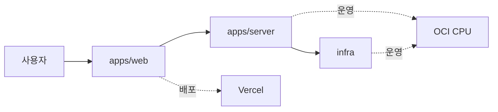

# 줍줍

<p align="center">
  전북대학교 수강신청을 위해 설계한 실시간 여석 알림, 강의 탐색, 시간표 관리 서비스
</p>

<p align="center">
  
  
  
  
</p>

<p align="center">
  <a href="https://zup-zup.com">운영 사이트</a> ·
  <a href="./docs/feature-updates.md">릴리스 노트</a> ·
  <a href="./docs/troubleshooting.md">트러블슈팅</a>
</p>

줍줍은 수강신청 과정에서 반복 새로고침, 늦은 대응, 흩어진 정보를 줄이기 위해 만든 서비스입니다.  
이 저장소는 사용자 화면, 백엔드 API, 운영 인프라를 하나의 모노레포로 묶어 제품과 운영을 함께 관리합니다.

## 프로젝트 개요

| 항목 | 내용 |
| --- | --- |
| 프로젝트 | 줍줍 |
| 목적 | 전북대 수강신청 경험 개선 |
| 초점 | 실시간성, 명확한 정보, 운영 단순성 |
| 운영 사이트 | [zup-zup.com](https://zup-zup.com) |
| 배포 | Web: Vercel / Server, Infra: OCI CPU + Docker |

## 왜 만들었나

- 수강신청 시간에는 정보가 빠르게 바뀌고, 늦게 보면 이미 늦습니다.
- 강의 검색, 시간표 확인, 알림 확인이 서로 분리되어 있으면 판단이 느려집니다.
- 운영 비용이 커지면 서비스 유지가 어렵습니다.

## 핵심 기능

- 실시간 여석 확인과 알림 흐름
- 강의 검색과 필터링 중심의 UI
- 시간표 기반 판단과 반복 탐색 최소화
- 강의 리뷰와 운영 API 제공
- 릴리스 기록과 트러블슈팅 기록의 분리

## 아키텍처



## 저장소 구조

| 영역 | 역할 | 위치 |
| --- | --- | --- |
| Web | 검색, 시간표, 리뷰, 알림 UI | [`apps/web`](./apps/web) |
| Server | 강의 수집, 인증, 알림, 운영 API | [`apps/server`](./apps/server) |
| Infra | Docker, 배포, 운영 자원 | [`infra`](./infra) |
| Docs | 릴리스와 트러블슈팅 기록 | [`docs`](./docs) |
| Internal | 작업 메모와 내부 맥락 | [`.agents`](./.agents) |

## 기술 스택

| 구분 | 기술 |
| --- | --- |
| Frontend | Next.js 16.1.6, React 19.2.7, TanStack Query, Zustand, React Hook Form, Zod |
| Backend | Spring Boot 3.5.9, JPA, Security, Redis, Flyway, Swagger/OpenAPI |
| Infra | Docker Compose, MySQL, Redis, Prometheus, Grafana, Loki, Promtail, Nginx Proxy Manager |
| 운영 | Vercel, OCI CPU |

## 기술 선택과 트레이드오프

| 선택 | 이유 | 트레이드오프 |
| --- | --- | --- |
| 모노레포 스타일 루트 | Web, Server, Infra를 한 곳에서 관리하고 문서를 함께 유지하기 위해 | 초기 구조 이해 비용이 생깁니다 |
| Web과 Server 분리 | 사용자 경험과 데이터 처리 책임을 분리하기 위해 | API 계약 관리가 필요합니다 |
| Vercel + OCI CPU | Web은 빠르고 저렴하게, Server와 Infra는 운영 친화적으로 유지하기 위해 | 배포 경로가 둘로 나뉩니다 |
| Docker Compose | 로컬과 운영 환경의 차이를 줄이기 위해 | 컨테이너 운영 개념이 필요합니다 |
| 문서 분리 | 릴리스, 트러블슈팅, 설계를 남기기 위해 | 문서 수가 늘어납니다 |
| 관측 스택 분리 | 서비스 상태를 숫자와 로그로 추적하기 위해 | 모니터링 구성 요소가 추가됩니다 |

## 도전과 해결

| 문제 | 해결 | 결과 |
| --- | --- | --- |
| 수강신청 정보가 빠르게 바뀌어 사용자가 판단하기 어려움 | 강의 검색, 시간표, 알림 흐름을 한 축으로 묶음 | 필요한 정보를 더 짧은 동작으로 확인할 수 있음 |
| Web과 운영 인프라의 요구가 달라 배포 경계가 복잡함 | Web은 Vercel, Server와 Infra는 OCI CPU + Docker로 분리 | 비용과 운영 난도를 함께 관리할 수 있음 |
| 문제 재현과 회고가 채팅으로 흩어짐 | `docs/feature-updates.md`, `docs/troubleshooting.md`로 기록 분리 | 배운 내용과 이슈 추적이 쉬워짐 |

## 실행 방법

### Web

```bash
cd apps/web
npm install
npm run dev
```

### Server

```bash
cd apps/server
./gradlew bootRun
```

### Infra

```bash
cd infra
docker compose up -d
```

## 배포 및 운영

- Web은 Vercel에서 배포합니다.
- Server와 Infra는 OCI CPU 인스턴스의 Docker 환경에서 운영합니다.
- Web 로그는 `/var/log/jbnu-sugang-helper/web/web.log`에 남습니다.
- Server 로그는 `/var/log/jbnu-sugang-helper/server/application.log`에 남습니다.
- 관측은 Prometheus, Grafana, Loki, Promtail 조합으로 구성합니다.

## 테스트와 검증

- Web은 `npm run test`로 Vitest 기반 검증을 수행합니다.
- Server는 `./gradlew test`, `./gradlew manualTest`, `./gradlew performanceTest`로 검증합니다.
- Infra는 `infra/scripts/verify-compose-policy.sh`, `infra/scripts/verify-log-policy.sh`로 정책을 확인합니다.

## 앞으로의 개선

- E2E 테스트 범위 확장
- 운영 지표와 성능 기록의 정기 정리
- 배포 자동화와 경로 기반 검증 정교화
- 화면별 스크린샷과 데모 자료 보강

## 관련 문서

- [릴리스 히스토리](./docs/feature-updates.md)
- [트러블슈팅 / 측정 기록](./docs/troubleshooting.md)
- [Web README](./apps/web/README.md)
- [Server README](./apps/server/README.md)
- [Infra README](./infra/README.md)
- [모노레포 전환 결정](./docs/decisions/2026-07-08-monorepo-migration-web-vercel-server-infra.md)

## 내가 이 프로젝트에서 본 것

- 문제를 작게 나누고, 사용자 흐름과 운영 흐름을 분리하는 습관
- 기능보다 배포와 유지보수를 먼저 생각하는 구조 설계
- 문서와 로그를 함께 남겨야 나중에 다시 고칠 수 있다는 점
