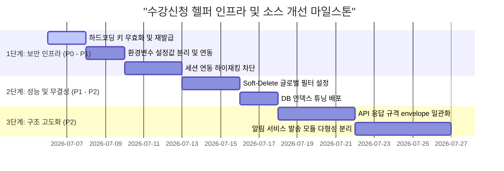

# 개선 로드맵 (Improvement Roadmap)

본 로드맵은 식별 위험 수준과 난이도에 기반하여 최적화한 순차적 마일스톤 이행 계획입니다.

## 세부 단계별 실행 지침

### 1단계: 중요 보안 결함 조치 (소요 기간: 7일)
* **목표**: 노출된 위험 키 무력화, 런타임 주입 체계 완성 및 무상태성 원칙 수립.
* **산출 파일**:
  * [보안 진단 보고서](file:///Users/bhoon/Project/jbnu-sugang-helper/docs/reviews/security_findings.md)의 조치 사항 반영.

### 2단계: 데이터 신뢰도 및 검색 가속 (소요 기간: 5일)
* **목표**: 논리 삭제 정합성 보존 및 텍스트 쿼리 검색 속도 최적화.
* **산출 파일**:
  * [데이터베이스 진단 보고서](file:///Users/bhoon/Project/jbnu-sugang-helper/docs/reviews/database_findings.md)의 복합 인덱스 및 소프트 딜리트 Restriction 반영.

### 3단계: 인터페이스 규격 및 확장성 확보 (소요 기간: 9일)
* **목표**: 공통 API 파서 구조화 및 알림 발송 채널 확장성 정립.
